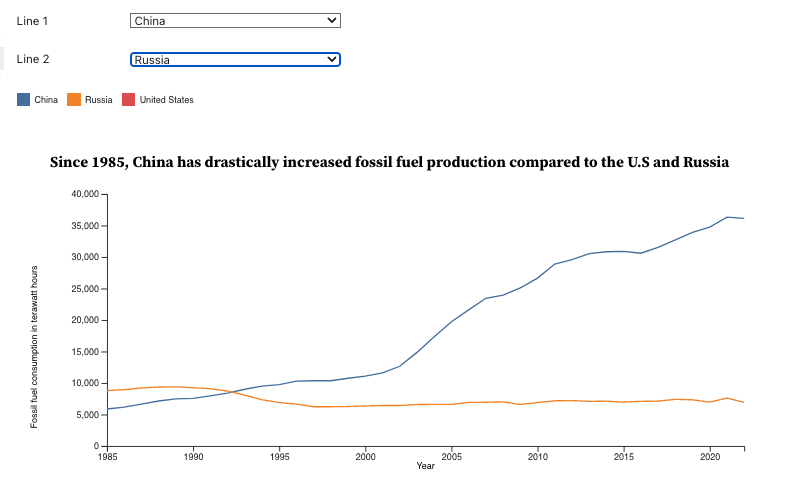

# Homework 5 - Dashboards and Interaction 

**Due:** *Wednesday*, March 19, 2025 before 3pm

*Read the entire assignment before starting.*

## Assignment

In this assignment, you will demonstrate multiple chart interactions in Vega-Lite and tooltip and selector interactions in D3.

Since you'll be creating both Vega-Lite and D3 charts, you may create a separate Observable notebook for each part.  The notebook that contains your charts should also contain the explanation for that chart (i.e., don't separate your report description from your chart).  You can tie multiple notebooks together in a collection, as I've done with our [CS 725/825 collection](https://observablehq.com/collection/@oducs-vis/cs-725).  Your notebooks should be ordered appropriately in the collection, and each notebook must include your name, HW5, and the part that you are addressing with the notebook.

### Report

Your Observable notebook should function as your report. This means that after successfully creating your charts, you must go back and edit your notebook to add Markdown cells with explanations, remove items that didn't work, etc. In general, make sure that it is clear what you have done to create the charts.

Your notebook must have a References section, with links to references that you used, and an Appendix section, with needed imports (D3, Arquero, Vega-Lite, Swatches, etc.)

### Part 1 - Vega-Lite Dashboard

Construct a simple dashboard of at least two charts in Vega-Lite where a selection in one chart affects the display of the other chart.  Since you are building a dashboard, these charts must be displayed in the same Observable cell (use `vconcat` and/or `hconcat`).  *The dashboard design and layout must be meaningfully different than the Vega-Lite dashboard examples covered in class.*

You may use one or more datasets of your choosing for this part of the assignment.  This could be the same datasets you've used for previous assignments, or a totally new dataset.

Explain your dashboard interactions in your report.  

Size your charts so that all can be viewed without scrolling (either horizontally or vertically).  To help with the horizontal direction, you can make use of the `width` Observable variable.

### Part 2 - D3 Interactions

Take the following charts from HW4 and add interactive features:

Chart 1 - scatterplot: Add tooltips  
Chart 2 - horizontal bar chart: Add tooltips  
Chart 5 - multi-line chart: Show at most 2 lines, add drop-drop menu selectors to select which items/categories should be shown in the 2 lines (see example image below - click for larger version)  
&nbsp; &nbsp; 

For Charts 1 and 2, your tooltips must be stylized in some manner (tooltips not required on Chart 5).  Explain what you have done to stylize the tooltips.

### Extra Credit

Build Part 1 using D3 (in addition to the implementation in Vega-Lite).

## Evaluation Criteria

Your assignment will be evaluated on the following criteria:

* Is the visualization idiom appropriate for the data that is shown?
* Does the Vega-Lite dashboard implement a meaningful interaction?
  * The difficulty of the interaction and number of charts will also be considered. (This does not mean to pack in as many charts as you can. The dashboard must still be designed thoughtfully.)
* Do the charts contain the required elements?
  * Attention to detail, including spelling, and overall aesthetics will be a factor.
* Was the data thoughtfully chosen?
* Does the report contain the required elements?
  * Attention to detail, including spelling, and overall aesthetics will be a factor.

## Submission

Submit the URL of your Observable notebook in the HW5 Assignment in Canvas.
